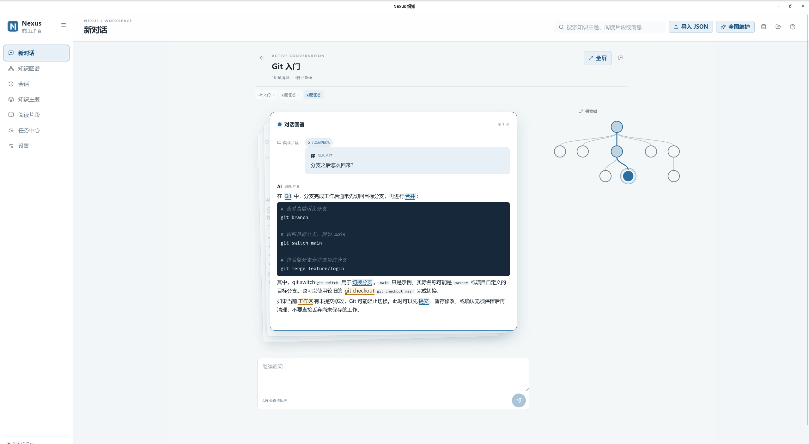
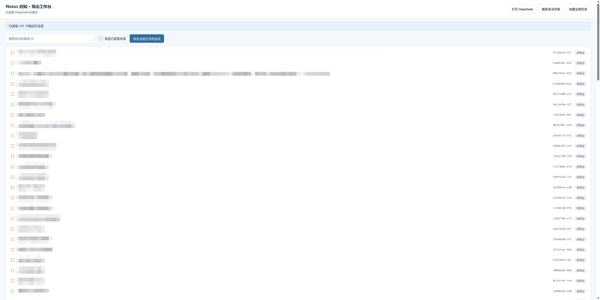
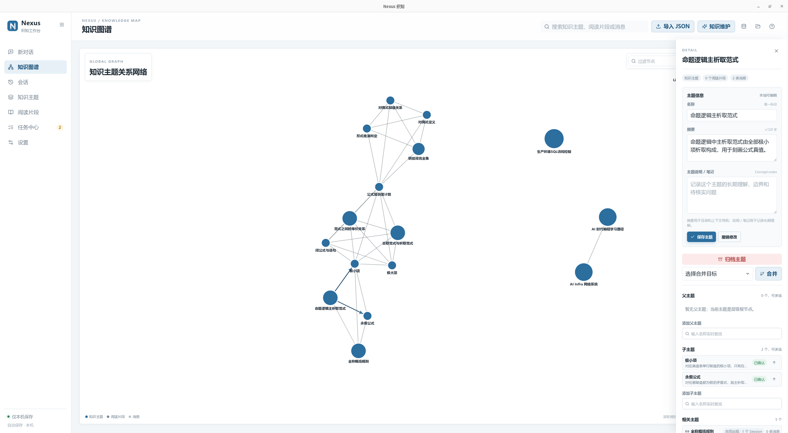
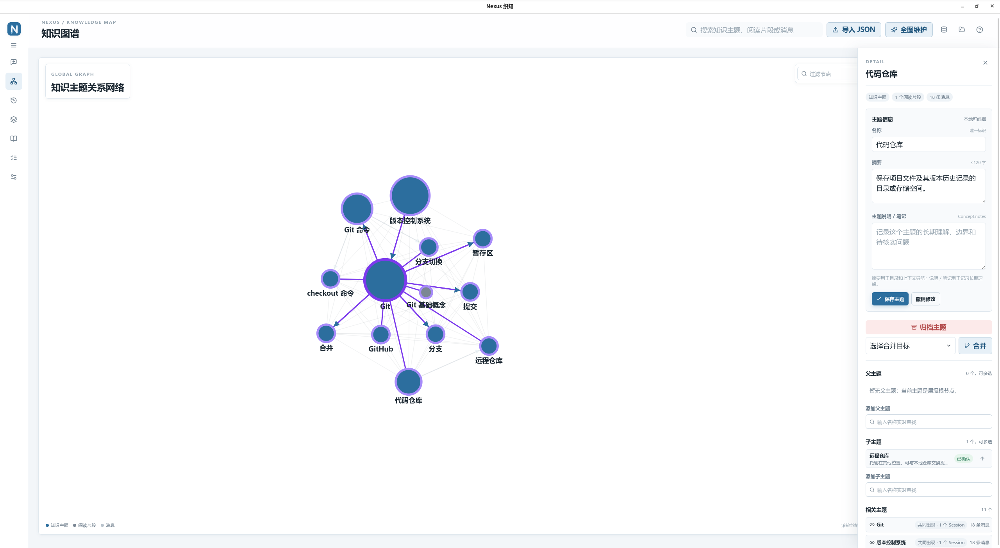
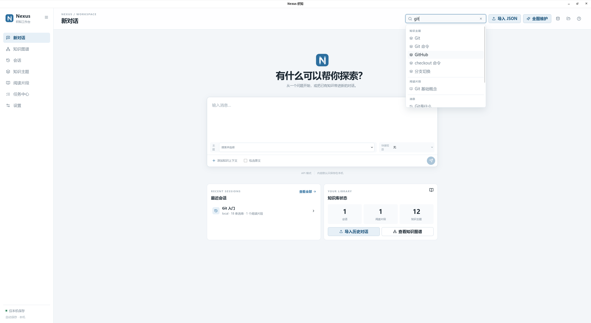
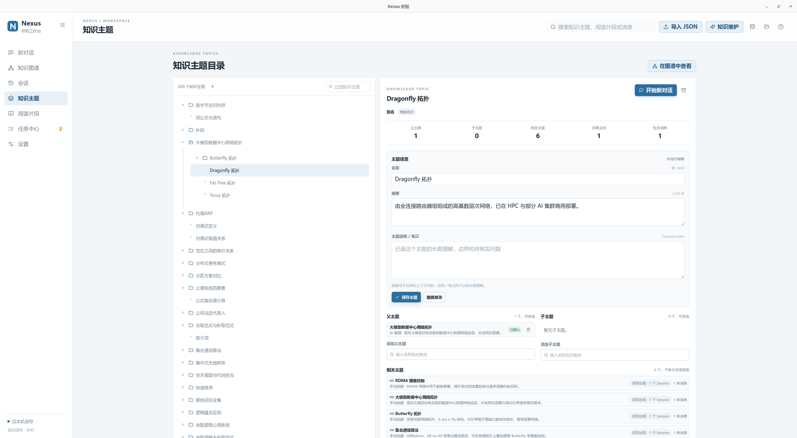

<div align="center">


# Nexus 织知

**把散落的 AI 对话，织成可继续探索的知识网络。**

本地优先的 AI 对话知识管理桌面应用 · Windows / Linux / macOS

<!-- 平台与技术 -->


<!-- GitHub 项目状态 -->
[](https://github.com/Micraow/nexus/releases)
[](https://github.com/Micraow/nexus/actions)
[](https://github.com/Micraow/nexus/stargazers)
[](https://github.com/Micraow/nexus/network)
[](https://github.com/Micraow/nexus/issues)

[](https://github.com/Micraow/nexus/commits/main)
[](https://github.com/Micraow/nexus/commits/main)
[](https://github.com/Micraow/nexus)
[](https://github.com/Micraow/nexus)
[](https://github.com/Micraow/nexus/blob/main/LICENSE)

<!-- 附加 -->
[](https://github.com/Micraow/nexus/pulls)
[](https://github.com/Micraow/nexus)

[](https://buaa.edu.cn/)
[](https://soft.buaa.edu.cn/index.jsp)

</div>

---

## 它解决什么问题

与大模型的对话越聊越长，读过的回答再难找到，不同会话里的同一个知识各说各的。Nexus 织知从完整会话和消息中直接识别多个知识主题及其层级，把同一份内容连接到所有适用的主题，汇聚成一张可检索、可追溯、可继续追问的塔式知识图谱。知识单元保留为按需创建的阅读片段或证据包，不再是导入和建图的必经步骤。

## 核心特性

| | |
|---|---|
| 📥 **对话导入** | 通过浏览器扩展导出 DeepSeek 历史会话，拖入应用即可导入；自动识别重复内容，原始对话始终完整保留 |
| 🧹 **自动整理** | 大模型从会话和消息中提炼可跨会话复用的知识主题，建立多主题归属并整理父子层级；结果先经过本地校验，待确认关系和不确定变更由你决定是否应用 |
| 🕸 **知识图谱** | 图谱默认只显示真实一级主题；单击节点即可打开详情并逐层展开或递归收起子主题、知识单元和消息。节点大小反映下级规模，关系线的深浅和粗细反映强度 |
| 🔍 **统一搜索** | 一个搜索框直达知识主题、知识单元和任意一条消息，中文短语也能准确命中 |
| 💬 **追问分支** | 从任意主题或探索节点继续提问，回答自动挂到当前分支，形成随时可以回看的探索树；常用问法可存为快捷短语 |
| 🧩 **上下文拼接** | 跨会话挑选知识主题、知识单元或消息，调整顺序并按需递归展开摘要与原文，作为新对话的背景资料 |
| 🤝 **两种整理模式** | API 模式接入 OpenAI-compatible 服务，支持流式对话和可配置自动重试；或使用 Prompt 粘贴模式，把提示词复制到任意网页端执行后贴回，不由 Nexus 发起网络请求 |
| 🛠 **知识维护** | 可执行全图维护、选中主题分支维护，或输入一条定向维护指令；维护任务使用渐进式披露，先看目录，再按需请求证据，不会把每个无关节点一次性塞给模型 |
| 📤 **多种导出** | 完整知识库、图谱快照、单个会话、主题卡片 Markdown，随时带走你的数据 |

## 安装指南

### 1. 安装浏览器扩展（DeepSeek 导出器）

> 扩展用于从 DeepSeek 网页端导出会话数据，是 Nexus 的数据入口。

- 访问 [Releases 页面](https://github.com/Micraow/nexus/releases) 下载最新版本的扩展压缩包，文件名为 `nexus-extension-<版本号>.zip`。
- 解压该压缩包，得到包含扩展源文件的文件夹（内含 `manifest.json` 等）。
- 打开 Chrome/Edge 等基于 Chromium 的浏览器，进入扩展管理页面（`chrome://extensions/` 或 `edge://extensions/`）。
- 开启右上角的 **“开发者模式”**。
- 点击 **“加载已解压的扩展程序”**，选择刚才解压出来的文件夹，即可完成安装。
- 安装后，在浏览器工具栏中点击 Nexus 织知图标，即可打开导出工作台，勾选需要导出的会话，点击导出并保存 JSON 文件。

> 💡 **备选方式**：部分浏览器也支持直接将 `.zip` 文件拖拽到扩展管理页面自动安装（若遇拦截则改用上述解压加载方式）。

### 2. 安装桌面应用（Nexus 织知）

- 同样在 [Releases 页面](https://github.com/Micraow/nexus/releases) 找到适合您操作系统的安装包：
  - **Windows**：`.msi` 或 `.exe`
  - **Linux**：`.deb`、`.rpm` 或 `.AppImage`
  - **macOS**：`.dmg`（Apple Silicon）
- 下载对应文件，双击运行并根据引导完成安装。
- 启动应用后，您可以直接拖入扩展导出的 JSON 文件，开始构建您的知识网络。

> 注意：桌面应用完全本地运行，首次启动会创建本地 SQLite 数据库 `nexus.db`，所有数据均保存在您的设备上。

## 快速上手

```text
1. 导入    拖入浏览器扩展导出的对话文件，原始内容先完整保存在本机
2. 整理    在设置中选择 API 或 Prompt 粘贴模式；任务队列会识别会话/消息的知识主题与层级，并显示渐进式披露、校验和重试状态
3. 探索    在图谱中从一级主题逐层展开，搜索直达任意消息；选中的摘要或原文可以递归带入新对话
```

更详细的开发、构建与调试指南请参阅 **[docs/development.md](docs/development.md)**。

## 界面预览

以下截图展示了 Nexus 织知的主要界面，点击可查看大图。

<div align="center">
<table>
<tr>
  <td align="center"><br /><b>探索视图</b></td>
  <td align="center"><br /><b>浏览器扩展</b></td>
  <td align="center"><br /><b>层级结构</b></td>
</tr>
<tr>
  <td align="center"><br /><b>高亮图谱</b></td>
  <td align="center"><br /><b>搜索面板</b></td>
  <td align="center"><br /><b>知识单元编辑</b></td>
</tr>
</table>
</div>

## 隐私与数据边界

> - 业务数据默认只保存在本机数据库，不发送遥测、统计或后台同步；
> - API 模式只在**你明确启动任务后**才发出网络请求，并明确告知发送范围；Prompt 粘贴模式完全离线；
> - 备份与导出**永不包含**配置文件和 API Key；
> - 消息内容只按正常 Markdown 展示，其中的文字永远只是数据，不会被执行。

## 技术栈

| 层 | 技术 |
|---|---|
| 桌面壳层 | Tauri 2.0 |
| 前端 | Vue 3 + TypeScript + Pinia |
| 存储 | 本机 SQLite 数据库（nexus.db）+ 全文索引 |
| 图谱 | D3.js 力向布局与渐进式层级投影 |
| 配置 | YAML 配置文件（与业务数据分离） |

## 文档

| 文档 | 内容 |
|---|---|
| [docs/design.md](docs/design.md) | 完整产品设计文档 |
| [docs/data-spec.md](docs/data-spec.md) | 数据规范 |
| [docs/implementation-notes.md](docs/implementation-notes.md) | 实现细节记录 |
| [docs/development.md](docs/development.md) | 本地开发、调试与打包指南 |

---

<div align="center">
<sub>Nexus 织知 · 程序设计实践课程作品 · 本地优先，数据归你</sub>
</div>

<hr>

<div align="center">
<a href="https://pengs.top" target="_blank" rel="noopener noreferrer">
  
</a>
</div>
