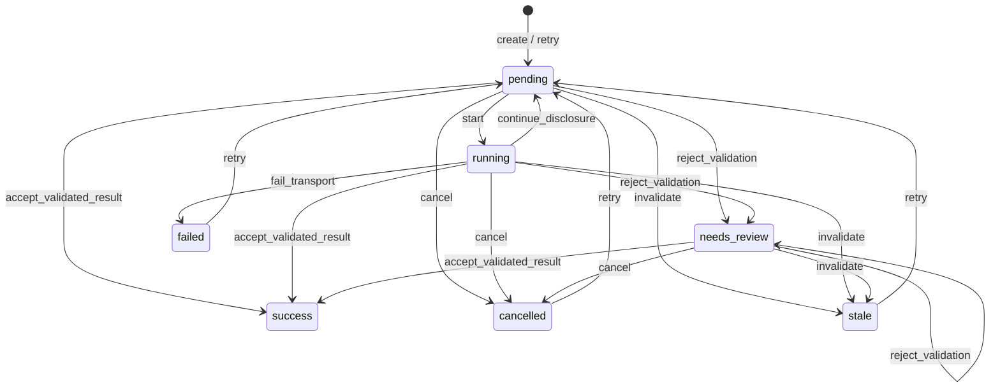
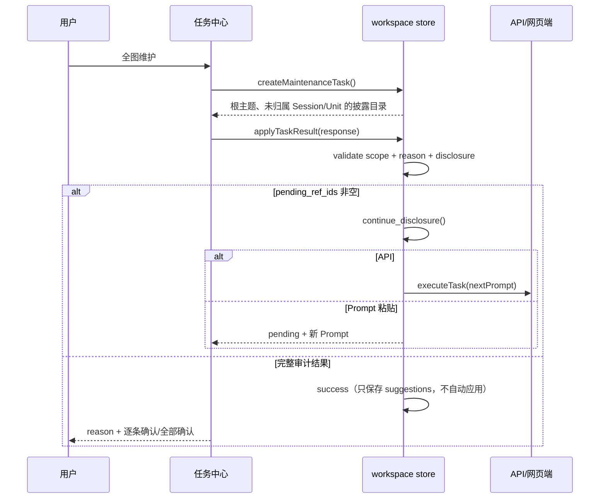
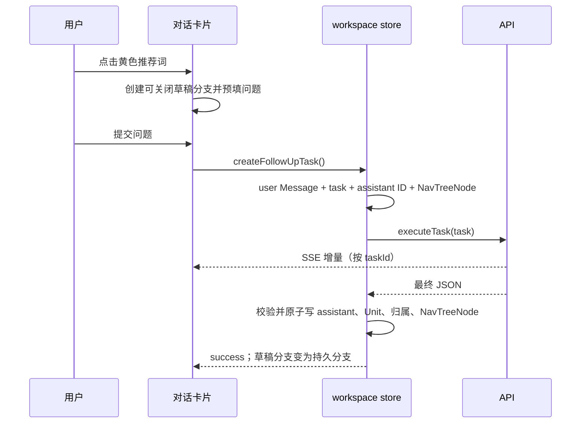

# Nexus 状态与接口审计

本文把任务队列、知识维护、对话分支和渐进披露放在同一份状态模型中。它是实现和验收的索引；具体字段约束仍以 `docs/data-spec.md`、Prompt 版本和本地校验器为准。

## 模块边界

| 模块 | 责任 | 不应承担的责任 |
|---|---|---|
| `services/task-state.ts` | 声明任务事件、合法来源状态和目标状态 | 写数据库、发请求、决定业务结果 |
| `services/prompts.ts` | 生成 Prompt、MCP 工具目录和披露目录格式 | 直接修改知识库 |
| `services/validation.ts` | 校验 JSON 结构、ID 白名单、标题/名称长度和 DAG 输入 | 猜测或修复越界 ID |
| `stores/workspace.ts` | 持久化任务转换、业务事实事务、队列租约和续轮 | 以 UI 状态代替数据库事实 |
| `App.vue` | 发送用户意图、显示任务和派生卡片状态 | 直接写任务状态或从数组长度推断成功 |
| `GraphCanvas.vue` | 绘制已投影的图谱、处理节点单击和布局事件 | 修改层级关系或推断隐藏节点 |

## 任务状态

`success` 是终态。`continue_disclosure` 必须同时保存本轮原始响应、下一轮 Prompt，清空 `parsed_result` 和校验错误，然后回到 `pending`。API 任务取得新的执行租约后再次进入 `running`；Prompt 粘贴任务等待用户复制新的 Prompt。任何仍有 `pending_ref_ids` 的维护任务都不能进入 success。

维护结果还有两道独立的提交门禁：维护响应在 `suggestions=[]` 时无论 API 还是 Prompt 粘贴模式都必须带非空总体 `reason`（API 模式对所有响应都执行该要求）；最终动作的 Concept、关系、别名、Session、Message 和 KnowledgeUnit ID 必须来自当前 Prompt 中已经展开并带 `content` 的实体。根目录或 children 中只有标题/摘要的导航引用不构成写入授权，越界结果整体进入 `needs_review`，不应用部分建议。

## 维护时序

维护入口的关注主题只是排序提示，任务范围始终是整个 active 图谱。动作参数中的 Concept、Session、Message 和 Unit ID 必须来自已披露的 `content`；越界结果整体进入 `needs_review`，不执行部分写入。`unit_create.title` 统一限制为最多 30 个 Unicode 字符。

## 对话时序

提交前草稿可以关闭；只要 user Message 或 task 已创建，关闭入口必须消失或禁用。流式文本只属于对应 `taskId` 的卡片，校验失败时保留在该卡片供修复，不能落到父卡片或在最终刷新时消失。全屏查看按 Session 分页，同一个 Session 的所有消息必须在同一页。

## 队列顺序

导入先保存原始 Session/Message，再创建 `session_triage`。队列优先执行分类；只有 `knowledge` 才创建/执行 `origin_concepts`，`discussion` 和 `procedure` 取消遗留起始任务；`mixed` 可直接进行有证据的提取。不同 Session 可并行，同一 Session 任务按依赖顺序串行。
