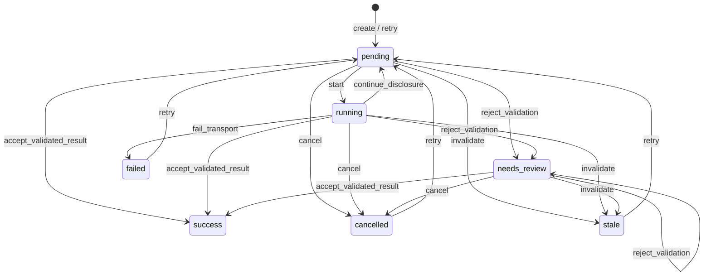
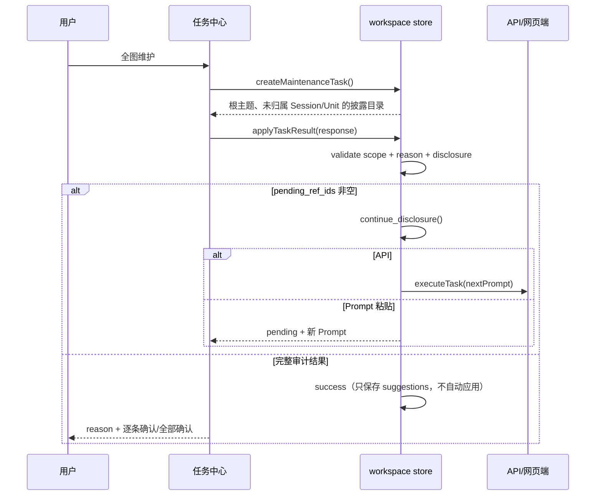
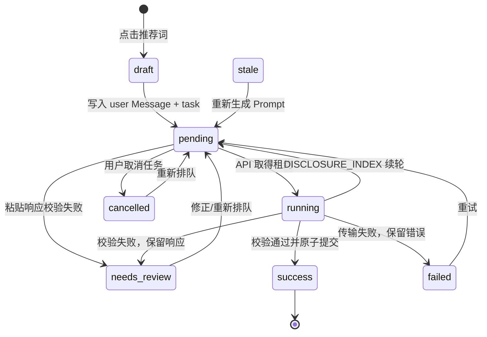
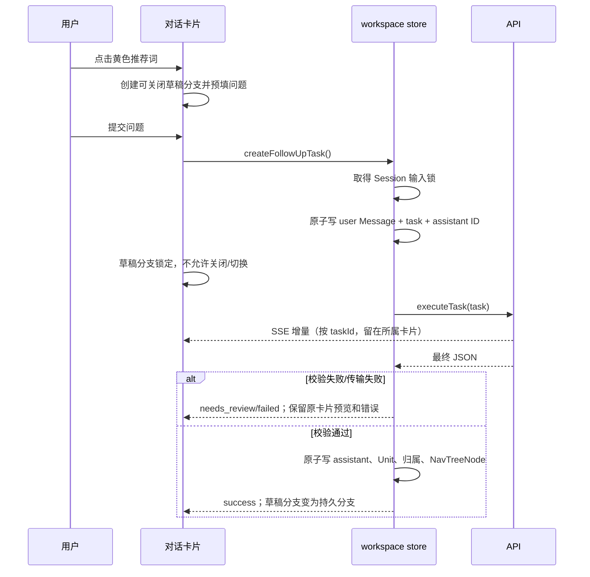
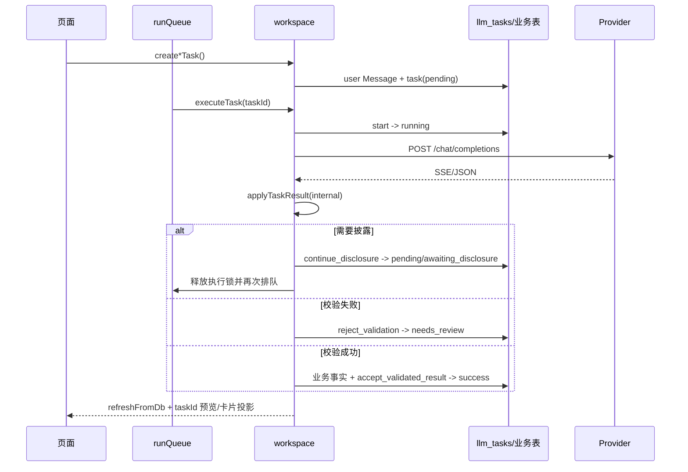

# Nexus 状态与接口审计

本文把任务队列、知识维护、对话分支和渐进披露放在同一份状态模型中。它是实现和验收的索引；具体字段约束仍以 `docs/data-spec.md`、Prompt 版本和本地校验器为准。

## 模块边界

| 模块 | 责任 | 不应承担的责任 |
|---|---|---|
| `services/task-state.ts` | 声明任务事件、合法来源状态和目标状态；由 `transitionTaskState()` 原子解析目标 status/phase | 写数据库、发请求、决定业务结果 |
| `services/prompts.ts` | 生成 Prompt、MCP 工具目录和披露目录格式 | 直接修改知识库 |
| `services/validation.ts` | 校验 JSON 结构、ID 白名单、标题/名称长度和 DAG 输入 | 猜测或修复越界 ID |
| `stores/workspace.ts` | 持久化任务转换、业务事实事务、队列租约和续轮；仅业务事实事务递增 `graph_revision` | 以 UI 状态代替数据库事实；任务轮询不得伪造图谱变更 |
| `App.vue` | 发送用户意图、显示任务和派生卡片状态 | 直接写任务状态或从数组长度推断成功 |
| `GraphCanvas.vue` | 绘制已投影的图谱、处理节点单击和布局事件 | 修改层级关系或推断隐藏节点 |

## 任务状态

`success` 是终态。`continue_disclosure` 必须同时保存本轮原始响应、下一轮 Prompt，清空 `parsed_result` 和校验错误，然后回到 `pending`。API 任务取得新的执行租约后再次进入 `running`；Prompt 粘贴任务等待用户复制新的 Prompt。任何仍有 `pending_ref_ids` 的维护任务都不能进入 success。

任务状态事件（start、retry、cancel、fail_transport、continue_disclosure）与图谱事实写入是两类事务：前者只更新 `llm_tasks`，不会递增 `graph_revision`；后者才使图谱投影缓存失效。这样队列轮询、重试和人工校验不会导致图谱闪烁。所有持久状态写入都先通过 `transitionTaskState(from, event)` 解析；调用方不得根据目标字符串直接写 `status`，这样 status 与 phase 不会出现交叉组合。

维护结果还有两道独立的提交门禁：维护响应在 `suggestions=[]` 时无论 API 还是 Prompt 粘贴模式都必须带非空总体 `reason`（API 模式对所有响应都执行该要求）；最终动作的 Concept、关系、别名、Session、Message 和 KnowledgeUnit ID 必须来自当前 Prompt 中已经展开并带 `content` 的实体。根目录或 children 中只有标题/摘要的导航引用不构成写入授权，越界结果整体进入 `needs_review`，不应用部分建议。若模型省略 `disclosure_requests` 但目录仍有 `pending_ref_ids`，任务同样不能成功；修复 Prompt 会列出待展开 ID（超出前 64 项的部分仍以目录为准），便于批量补发续轮请求。中间轮的总体 `reason` 保存在原始响应中，但只有最终 `success` 才能显示“无建议变更”。

## 维护时序

维护入口的关注主题只是排序提示，任务范围始终是整个 active 图谱。顶栏入口在所有模块稳定显示，浮层在切换模块时关闭但不改变 scope。动作参数中的 Concept、Session、Message 和 Unit ID 必须来自已披露的 `content`；越界结果整体进入 `needs_review`，不执行部分写入。`unit_create.title` 统一限制为最多 30 个 Unicode 字符。人工提交有效披露请求后，API 任务自动重新排队并发起下一轮；Prompt 粘贴任务保留 pending 等待下一次手动响应。

## 对话状态机

对话分支和 LLM 任务是两个有关联、但不能互相代替的状态机。新会话的根 `NavTreeNode` 可以在首问任务创建时先持久化；推荐词产生的后续临时节点只在回答通过校验后持久化。临时节点只存在于 `App.vue`，其 `taskId` 一旦写入就代表分支已经开始。

| 分支状态 | 事实依据 | 可见操作 | 合法后继状态 |
|---|---|---|---|
| `draft` | 临时节点没有 `taskId`，没有用户消息 | 修改预填问题、关闭分支、提交问题 | `pending` |
| `pending` | 已写入用户消息和 conversation task | 等待 API/粘贴 Prompt；禁止关闭和切换到其他分支 | `running`、`needs_review`、`failed`、`cancelled` |
| `running` | task 已取得执行租约 | 显示对应卡片的流式预览；禁止关闭和切换 | `success`、`needs_review`、`failed`、`cancelled`、`pending`（披露续轮） |
| `needs_review` | 响应已保存但本地校验失败 | 在原卡片/任务详情修正并重新提交；禁止关闭 | `pending`、`success`、`cancelled`、`stale` |
| `failed` | 传输或响应不可用，原始响应/错误已保存 | 重试；仍不可关闭，避免丢失用户已开始的分支 | `pending` |
| `success` | assistant、阅读片段、归属和导航节点已在同一事务提交 | 继续追问、切换分支 | 新的子分支 `draft` |
| `cancelled` / `stale` | 任务被取消或输入版本失效 | 重新排队；分支记录保留 | `pending` |

核心不变量：

1. 同一 Session 同时最多一个 `pending`、`running` 或 `needs_review` 的 conversation task；创建追问必须先取得 Session 输入锁。
2. `taskId`、持久化 user Message 或 assistant Message 任意一个存在，都表示分支已经开始；只有 `draft` 可以关闭。页面的 `started` 字段不能覆盖这个事实。
3. 流式预览按 `taskId` 索引，并且只渲染在该任务所属的当前卡片；成功、失败和 `needs_review` 都不能把回答移到父卡片或清空。
4. 点击推荐词先创建独立临时卡片，提交时以其父节点创建独立 conversation task；回答成功后才把临时节点替换为持久 `NavTreeNode`。
5. 一个任务的 assistant Message 只允许由 `applyTaskResult` 写入一次；重复提交必须被终态任务拒绝。

## 对话时序

提交前草稿可以关闭；只要 user Message 或 task 已创建，关闭入口必须消失或禁用。流式文本只属于对应 `taskId` 的卡片，校验失败时保留在该卡片供修复，不能落到父卡片或在最终刷新时消失。全屏查看按 Session 分页，同一个 Session 的所有消息必须在同一页。

## 队列顺序

导入先保存原始 Session/Message，再创建 `session_triage`。队列优先执行分类；只有 `knowledge` 才创建/执行 `origin_concepts`，`discussion` 和 `procedure` 取消遗留起始任务；`mixed` 可直接进行有证据的提取。不同 Session 可并行，同一 Session 任务按依赖顺序串行。

## 分层状态与接口连接

状态机不是一个布尔值，而是五个相互关联的投影。持久任务状态是唯一的完成事实，其余状态都必须能从任务、消息、导航节点或运行时索引重新推导。

| 层 | 状态/事实 | 写入者 | 读取者 | 边界 |
|---|---|---|---|---|
| 任务持久层 | `LLMTask.status` + `phase`、响应、校验错误、输入版本 | `createTask`、`transitionTask*` | 任务中心、队列、对话卡片 | 只能由命名事件转换，不能直接赋值 |
| 队列运行层 | `queueRunning`、`queuePaused`、`queueActiveCount`、`executingTaskIds`、AbortController | `runQueue`、`executeTask` | 设置页、任务中心、取消/重试动作 | 进程内状态，重启后从任务表恢复 |
| 披露层 | Prompt 内 `DISCLOSURE_INDEX.round`、`roots`、`expansions`、`pending_ref_ids` | `continueDisclosureTask`、`replaceDisclosureContext` | Prompt 构造器、响应校验、修复 Prompt | 目录 refID 是授权范围；只有 expansion.content 授权写入 |
| 对话分支层 | `draft` 或由 task/message/nav node 推导的 durable branch state | `createConversationTask`、`createFollowUpTask`、`conversation.ts` | 对话卡片、探索树、会话恢复 | `taskId`、user Message、assistant Message 任一存在即不可关闭 |
| 流式预览层 | `streamingTaskText[taskId]` | `executeTask` 的 SSE 解析器 | 当前任务所属卡片 | 非持久预览；成功/失败/待检查均按 taskId 清理或保留展示 |

接口连接顺序如下：

1. UI 意图调用 `createTask`、`createConversationTask` 或 `createFollowUpTask`，事务先写用户事实，再写任务。
2. API 队列调用 `runQueue → executeTask → transitionTask(start)`；Provider 响应回到 `applyTaskResult(internal=true)`。
3. `applyTaskResult` 先解析 JSON，再经过披露、范围、版本和业务校验；中间披露调用 `continueDisclosureTask`，最终结果调用 `transitionTaskInTransaction(accept_validated_result)` 并在同一事务写业务事实。
4. Prompt 粘贴由任务中心调用同一 `applyTaskResult`；若续轮，任务恢复为 `pending/awaiting_disclosure`，页面必须显示新 Prompt，不能显示成功。
5. `refreshFromDb` 只重新加载持久事实；图谱由 `graph_revision` 失效，流式文本和草稿分支不应触发图谱 revision。

## 审计发现与重构边界

当前实现已经把大部分隐式状态收拢到命名事件，但仍有以下需要后续明确或重构的地方：

- `transitionTaskState(from, event)` 现在是唯一的事件解析源，`canTransitionTask` 与 `canTransitionTaskStatus` 都从它派生；后者仍是仅供兼容调用方的目标状态查询。任何写入必须走 `transitionTask*`，不要在业务层复制来源/目标映射。
- `markTask(status)` 通过目标状态反推事件；对 `pending` 目标会选择 `retry`，因此对已经 pending 的任务是刻意 no-op。调用方不应把它当作通用状态设置器，必要时应直接表达 `continue_disclosure` 或 `retry` 事件。
- 同一 Session 的 conversation 输入锁目前是 store 内对 `tasks.value` 的检查，不是数据库唯一约束或事务租约。两个并发调用可能在刷新前同时创建追问；后续应增加 Session 级 lease/唯一活动任务约束，并让恢复流程处理过期 lease。
- `runQueue` 会在存在任意 `session_triage` 时暂停其他类型任务，因此导入分类优先级是全局的，不是按 Session 的局部依赖。该策略符合“分类先于起始主题”，但可能阻塞一个无关的新对话；后续应决定是否改为每个 Session 独立依赖队列。
- 分类结果为 `mixed` 时，当前代码不会创建 `origin_concepts`；文档中的“mixed 可直接进行有证据的提取”尚无对应自动任务。需要产品决定：维持“只有 knowledge 创建起始主题任务”，还是为 mixed 创建独立的直接提取任务，不能让两份规范继续分叉。
- 流式文本只存在内存，窗口关闭或刷新会丢失未完成预览；最终 JSON 未通过校验前不写 assistant Message 是正确的，但若需要崩溃恢复，应增加按 taskId 的可恢复增量日志，而不是把预览伪装成 Message。
- `phase` 在类型层保持可选以兼容旧备份，数据库列是必填。读取旧行时通过 `taskPhaseForStatus` 推导；迁移和导出必须继续保留这一兼容路径，不能让 UI 直接依赖 `phase` 非空。

以上问题不阻塞当前事件模型和披露门禁；它们是下一次架构重构的输入，不能由页面按钮或数组长度临时绕过。
